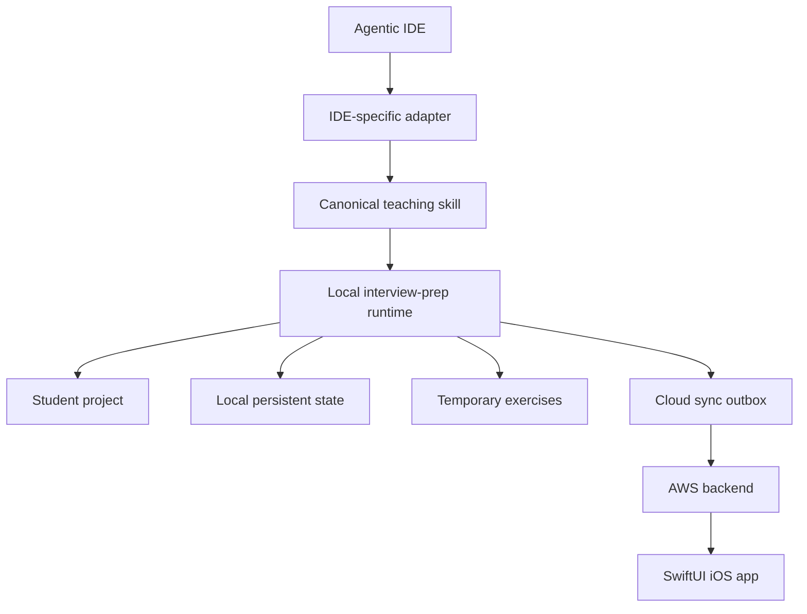
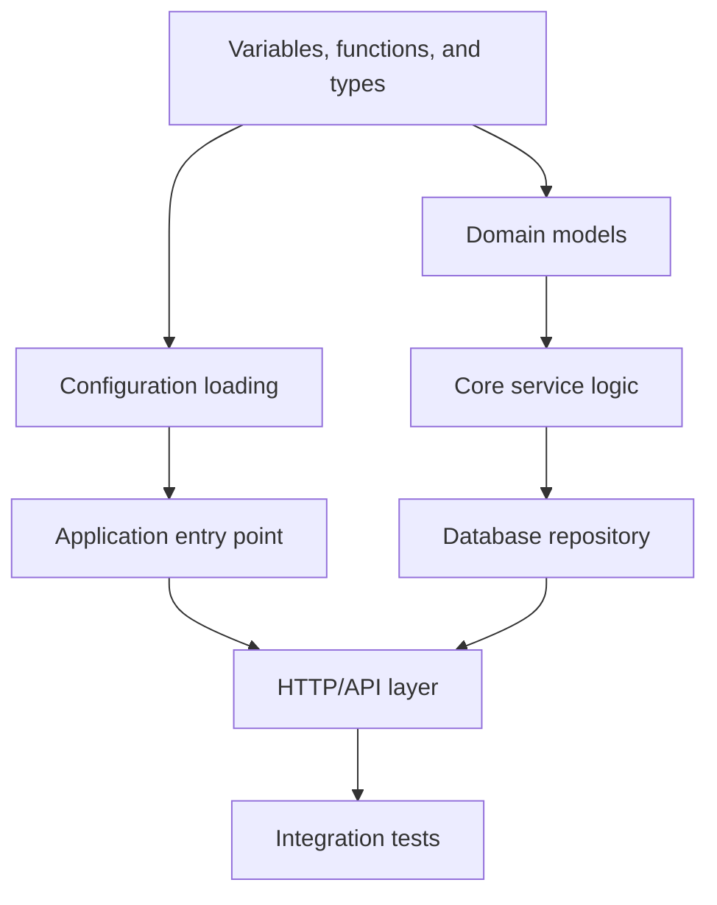
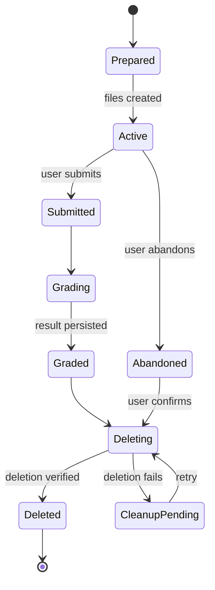
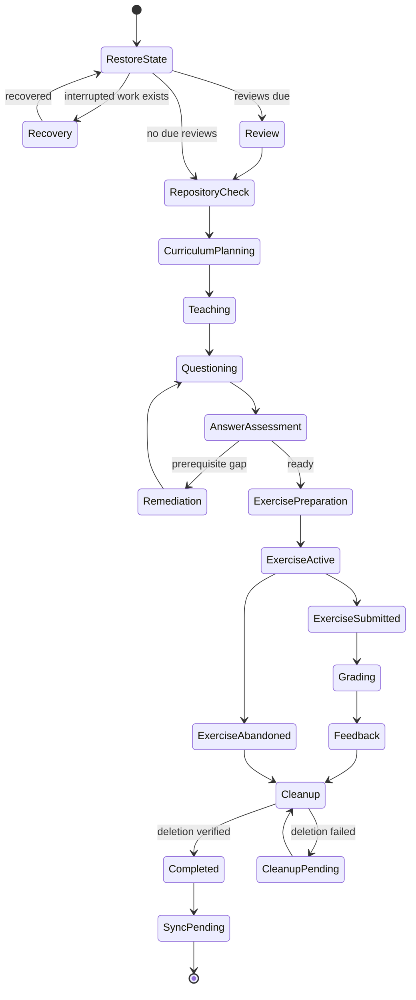
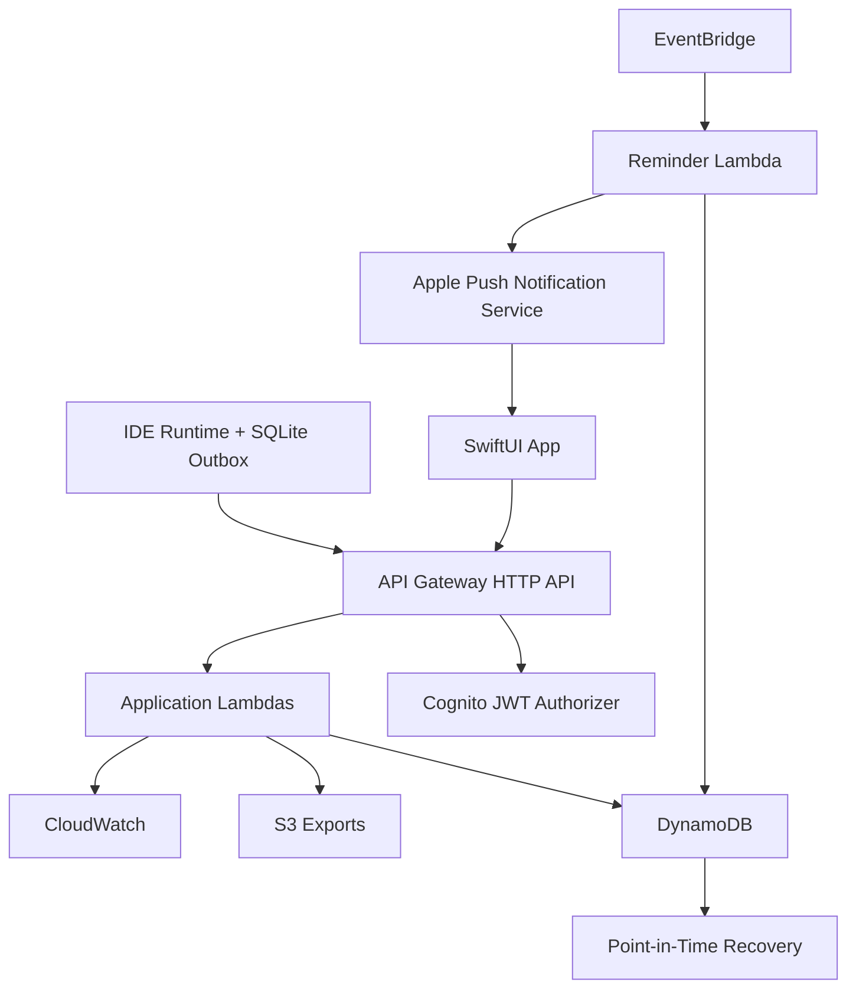
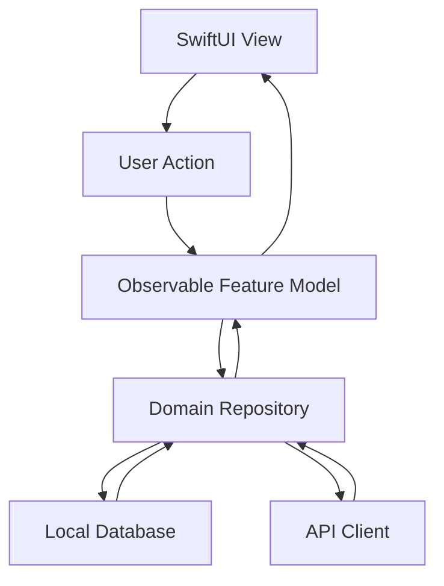

# Project-Based Interview Readiness Platform

> Canonical product, architecture, schema, workflow, and implementation blueprint.
>
> This document is intended to be sufficient for another engineering agent to plan and implement the platform without relying on prior chat context. No implementation has started yet. Decisions marked as recommended are accepted product decisions unless a later specification explicitly supersedes them.

---

# 1. Product definition

This platform turns any existing computer-science project into a structured, stateful interview-preparation curriculum.

The student works primarily inside their chosen agentic IDE. The agent:

1. Analyzes the project locally.
2. Builds a curriculum in a natural learning order.
3. Selects one small project area at a time.
4. Teaches every required syntax construct and concept.
5. Asks 2–3 interview-style questions.
6. Grades the student’s answers using an explicit rubric.
7. Generates a temporary coding exercise using only concepts already taught.
8. Grades the exercise.
9. Records mistakes, correct answers, mastery changes, and revision items.
10. Deletes the temporary exercise.
11. Synchronizes learning records to AWS.
12. Continues from the exact stored state in future chats.

The SwiftUI app is the companion interface for:

- Daily progress
- Session history
- Questions and answers
- Grades
- Mistakes
- Concept mastery
- FSRS revisions
- Streaks
- Notifications

It is not intended to replace the IDE as the main teaching or coding environment.

---

# 2. Confirmed decisions

| Area | Decision |
|---|---|
| IDE integration | Vendor-neutral canonical skill with thin adapters |
| Initial user count | One user |
| Source references | Repository-relative paths such as `internal/auth/service.go` |
| Primary interaction | Agentic IDE chat |
| iOS purpose | Logs, history, progress, mistakes, and scheduled revisions |
| Exercises | Created locally, completed in the IDE, deleted after durable grading |
| Git | May be inspected locally; never pushed by the platform |
| Authentication | Username and password |
| Password handling | Cognito-managed secure password hashing; no custom password database |
| Local operation | Offline-first |
| Cloud role | Synchronization, logs, iOS access, FSRS canonical state, streaks, notifications |
| Source repository upload | Not required |
| Cloud learning records | Questions, student answers, expected answers, rubrics, grades, mistakes, and mastery |
| Revision algorithm | FSRS |
| Daily goal | User-selected, with adaptive session composition |
| Progression | Chronological/project-flow curriculum with overdue reviews first |
| Repository support | Git and non-Git folders |
| Notification delivery | Local notifications plus AWS-triggered APNs |
| Product strategy | MVP with a documented production-ready path |

---

# 3. Core architectural principle

A prompt or skill file alone is not reliable enough for durable state, authentication, synchronization, concurrency control, and exercise cleanup.

The recommended system has three local layers:



## 3.1 Canonical skill

The skill contains the teaching methodology and behavioral rules:

- How to inspect a repository
- How to build the curriculum
- How to select the next unit
- How to teach syntax
- How to teach concepts
- How to construct interview questions
- How to grade answers
- How to create exercises
- What the agent may and may not do during an exercise
- How to record results
- How to resume interrupted sessions

The canonical skill must not assume vendor-specific tool names, chat identifiers, patch formats, model providers, or terminal APIs.

## 3.2 IDE adapters

Each supported IDE gets a small adapter explaining how to:

- Read and search project files
- Run local commands
- Create and delete exercise files
- Call the local runtime
- Load state at the beginning of a chat
- Save events after every meaningful transition

Planned adapters:

1. Zed
2. Codex
3. Antigravity
4. Other agentic IDEs as needed

The methodology remains identical; only tool invocation differs.

Each adapter should expose or describe these capabilities:

| Capability | Purpose |
|---|---|
| Repository-root discovery | Establish relative-path namespace |
| File listing and metadata | Explore repository structure |
| Bounded file reads | Inspect relevant source |
| Search | Find symbols, imports, references, and concepts |
| File write/delete | Manage temporary exercises |
| Command execution | Run tests, compilers, and static checks |
| User interaction | Present lessons and collect answers |
| Chat identity | Associate host chats with canonical sessions |
| Cancellation | Safely interrupt operations |
| Optional Git access | Inspect status, log, blame, history, and diffs |

Adapters report their capabilities. The system degrades gracefully when capabilities are missing.

Examples:

- Without Git, chronology uses dependency structure and project flow.
- Without terminal execution, grading uses static inspection and student explanations.
- Without durable IDE chat IDs, the runtime uses its own session IDs.

## 3.3 Local runtime

A small local CLI/runtime provides deterministic operations that should not depend on an LLM remembering instructions.

It is not required to run continuously. The IDE agent invokes it when needed.

Responsibilities:

- Initialize a project
- Maintain the SQLite database
- Lock active sessions
- Record events transactionally
- Reserve questions and exercises to prevent repetition
- Validate relative paths
- Check Git ignore status
- Manage exercise lifecycle
- Maintain the synchronization outbox
- Authenticate with AWS
- Reconcile repository changes
- Calculate provisional FSRS schedules offline
- Expose the next permitted workflow action

The agent handles natural-language teaching and qualitative grading. The runtime handles durable facts and workflow integrity.

## 3.4 Policy and capability guard

Consequential operations should pass through deterministic checks:

- Reject writes outside the exercise directory.
- Reject absolute paths in durable records.
- Reject path traversal and symlink escapes.
- Reject exercise creation if its directory is not ignored.
- Reject network-enabled grading commands by default.
- Reject Git push, remote mutation, reset, clean, rebase, destructive checkout, and history rewriting.
- Reject grading transitions that skip answer submission.
- Prevent concurrent sessions from grading or deleting the same exercise.
- Ensure a grade is durable before exercise deletion.

A behavioral skill cannot perfectly guarantee that every third-party model follows instructions. Deterministic runtime checks must enforce filesystem, workflow, persistence, and Git boundaries wherever possible.

---

# 4. End-to-end user experience

## 4.1 First-time project setup

The user adds the canonical skill and relevant IDE adapter to a project.

The agent then:

1. Locates the repository or workspace root.
2. Checks whether the project was previously initialized.
3. Creates a local project identity.
4. Creates `.interview-prep/`.
5. Ensures `.interview-prep/` is ignored by Git.
6. Detects languages, frameworks, package managers, build commands, and tests.
7. Records the repository’s baseline build/test condition.
8. Scans the project structure.
9. Builds a dependency, execution-flow, and concept graph.
10. Produces an initial curriculum.
11. Stores all state locally.
12. Optionally synchronizes the curriculum summary to AWS.
13. Starts the first learning unit.

Initialization must be resumable. A failed scan must not force the entire repository to be analyzed again.

## 4.2 Beginning any future chat

The skill’s first operation must always be state restoration—not repository exploration.

It loads:

- Project identity
- Active or interrupted session
- Current curriculum position
- Previously taught syntax
- Concept mastery
- Questions already asked
- Exercise families already used
- Due FSRS reviews
- Mistakes requiring remediation
- Repository changes since the last session
- Pending cloud synchronization

The agent then chooses one of these actions:

1. Resume interrupted teaching.
2. Resume pending questions.
3. Resume an active exercise.
4. Finish grading a submitted exercise.
5. Retry exercise cleanup.
6. Start due FSRS reviews.
7. Select a new learning unit.

A new chat never means a new curriculum.

## 4.3 Daily session flow

The recommended daily ordering is:

1. Overdue FSRS reviews
2. Recent high-severity mistakes
3. New project material
4. Coding exercise
5. Session recap

The user chooses a daily duration or workload target. The planner adjusts the proportions without sacrificing prerequisites.

Example 30-minute session:

| Activity | Approximate time |
|---|---:|
| Due revisions | 5 minutes |
| New file/concept teaching | 10 minutes |
| Interview questions | 7 minutes |
| Exercise | 6 minutes |
| Feedback and summary | 2 minutes |

A session may stop after questions if the student has insufficient time for the exercise. The exercise should only be created when the student is ready to start it.

---

# 5. Repository exploration strategy

## 5.1 Establish boundaries

Before curriculum analysis:

- Detect the repository/workspace root.
- Detect nested repositories and submodules.
- Load ignore rules.
- Identify generated, vendored, build, dependency, binary, and secret-like paths.
- Confirm the writable exercise directory.
- Determine available build and test tooling.
- Prevent symlinks from escaping the repository root.

## 5.2 Initial inventory

Gather structural information without reading every source file:

- Relative paths
- File types
- File sizes
- Manifest files
- README and documentation
- Entry points
- Tests
- Build scripts
- Dependency configuration
- Database schemas
- API definitions
- Generated and vendored directories
- Module boundaries
- Git history, if available

Excluded by default:

- Dependency directories
- Build artifacts
- Generated code
- Binary files
- Lockfiles as teaching targets
- Minified code
- Large fixtures
- External submodules unless relevant
- `.interview-prep/`

## 5.3 Conceptual analysis

The next pass establishes:

- Application entry point
- Startup/configuration flow
- Input flow
- Core domain types
- Business logic
- Persistence layer
- External integrations
- Output/UI layer
- Error handling
- Tests
- Deployment configuration

The agent reads only enough relevant content to build this model. It does not need to place all source text in persistent state.

## 5.4 Curriculum graph

Curriculum nodes are small learning units. Edges indicate:

- Syntax prerequisites
- Concept prerequisites
- Runtime dependencies
- Module dependencies
- Architectural dependencies
- Testing dependencies

Example:



---

# 6. Natural chronological learning order

“Chronological” should not mean alphabetical file order or raw Git commit order.

It means the order in which a beginner can most naturally understand how the project works and could have been built.

## 6.1 Ordering priorities

1. Basic syntax needed by the project
2. Small domain types and simple utility functions
3. Configuration and startup
4. Main execution flow
5. Core business logic
6. Persistence and external effects
7. API or UI orchestration
8. Error handling
9. Tests
10. Advanced abstractions
11. Performance, concurrency, and deployment concerns

## 6.2 Ordering signals

Use these signals in descending importance:

1. Foundational syntax prerequisites
2. Runtime execution sequence
3. Dependency direction
4. Project-development narrative
5. Complexity progression
6. Student mastery
7. Git history as supporting evidence

Git history is a hint, not curriculum authority. Useful signals include first introduction, co-change relationships, renames, and evolution from simple to more complex behavior. Do not check out old commits into the student’s working tree merely to teach history.

## 6.3 Selection signals

A candidate learning unit is ranked using:

- Prerequisite readiness
- File cohesion
- Runtime-flow position
- Number of new syntax forms
- Number of new concepts
- File size
- Architectural centrality
- Interview relevance
- Exercise suitability
- Student’s current mastery
- Recent repository changes
- Similarity to previous units

## 6.4 Default unit size

A unit normally contains:

- One or two related files
- Two to five new concepts
- Two or three interview questions
- One short exercise

One file is allowed when adding another file would create unnecessary complexity.

Three files are allowed only when the behavior cannot reasonably be understood with two.

## 6.5 Common file pairings

Good pairings include:

- Type definition + first meaningful use
- Interface + implementation
- Handler + service
- Service + repository
- Function + focused unit test
- Input model + validation
- Configuration + startup
- Component + state model

---

# 7. Curriculum selection algorithm

## 7.1 Candidate generation

Generate candidates from:

- One small foundational file
- Definition plus first meaningful use
- Implementation plus focused test
- Input model plus transformation
- Interface plus one concrete implementation
- Adjacent layers in runtime flow

A candidate is rejected when:

- It is generated or vendored.
- It exceeds the current cognitive budget.
- Its essential prerequisites have not been introduced.
- The same source structure was already taught.
- The same file pair was recently completed.
- It introduces too many unrelated concepts.
- It cannot produce a meaningful interview question or exercise.
- Its files changed after analysis and have not been rescanned.
- It relies on unavailable tooling without a viable static alternative.

## 7.2 Candidate score

Conceptually:

```text
candidate score =
  prerequisite readiness
  + project-flow continuity
  + interview relevance
  + file cohesion
  + exercise suitability
  + appropriate mastery gap
  + architectural value
  - cognitive overload
  - repetition risk
  - source volatility
  - hidden prerequisites
```

## 7.3 Deterministic tie-breaking

If multiple candidates have similar scores, choose:

1. Fewer new concepts
2. Earlier runtime stage
3. Smaller source surface
4. Better testability
5. Earlier Git introduction
6. Stable relative-path ordering

## 7.4 Selection record

Every selection should store:

- Files selected
- Current file fingerprints
- Why the files belong together
- Why the unit is next
- Required prerequisites
- Learning objectives
- Syntax to teach
- Concepts to teach
- Intended question families
- Intended exercise family
- Estimated time
- Rejected alternatives and reasons

This makes planner behavior auditable.

---

# 8. Teaching methodology

The default assumption is that the student does not know the language syntax.

The system distinguishes:

1. **Exposed:** the student has seen the syntax.
2. **Understood:** the student correctly explained it.
3. **Applied:** the student used it in an exercise.
4. **Retained:** the student recalled or transferred it later.

Simply displaying a lesson does not imply mastery.

## 8.1 Unit teaching sequence

### Step 1: Orientation

Explain:

- What the selected files do
- Where they sit in the project
- What runs before them
- What they call afterward
- Why they are being studied together

### Step 2: Syntax inventory

Teach every syntax form required to understand the selected code.

For example, in Go:

- Package declaration
- Imports
- Variable declaration
- Functions and return values
- Structs
- Methods and receivers
- Interfaces
- Pointers
- Error values
- Multiple assignment
- `if err != nil`
- `defer`
- Goroutines and channels, if present

No unexplained punctuation or terminology should remain.

### Step 3: Concept instruction

Teach the ideas behind the syntax:

- State
- Control flow
- Encapsulation
- Dependency inversion
- Error propagation
- Immutability
- Concurrency
- Transactions
- Testing boundaries

### Step 4: Guided project reading

Walk through the selected code in runtime order, not necessarily top-to-bottom.

Cover:

- Inputs
- Outputs
- Control flow
- Data transformations
- Side effects
- Failure paths
- Dependencies
- Design tradeoffs

### Step 5: Comprehension checkpoint

The student can request clarification before assessment.

Clarification may explain prerequisites but must not answer the upcoming interview questions.

### Step 6: Interview questions

Ask 2–3 questions.

### Step 7: Answer grading and remediation

Grade answers before issuing the exercise.

If a critical prerequisite is misunderstood:

- Explain the missed point.
- Ask a different question from another semantic family.
- Do not merely repeat the original wording.
- Delay the exercise until the student reaches the readiness threshold.

### Step 8: Exercise

Generate a temporary exercise using only taught material.

### Step 9: Exercise grading

Run permitted validation, grade using the rubric, ask the student to explain the solution where needed, and update mastery.

### Step 10: Cleanup and recap

Persist the grade first, delete the exercise, verify deletion, and summarize the session.

---

# 9. Interview-question design

Each unit should use different cognitive categories.

## 9.1 Question categories

### Explanation

- What does this construct do?
- What problem does this abstraction solve?
- Explain this code as if speaking to an interviewer.

### Execution tracing

- What happens when this function is called?
- What value is produced at each step?
- Where can this path fail?

### Design reasoning

- Why did this project use this design?
- Why use an interface here instead of a concrete type?
- What are the tradeoffs?

### Comparison

- How is this different from another language feature?
- Why use this and not inheritance, callbacks, or global state?
- When would the alternative be preferable?

### Project-specific application

- Why is this better for this particular project?
- What would break if this dependency were removed?
- How would you extend this feature?

### Edge cases

- What happens on malformed input?
- How is concurrent access handled?
- What could cause a race, leak, or inconsistency?

## 9.2 Question set composition

A typical three-question set should include:

1. One explanation question
2. One execution or debugging question
3. One design, comparison, or extension question

Questions must not be three paraphrases of the same fact.

## 9.3 Repetition prevention

Each question gets a semantic `questionFamilyId` based on:

- Concepts tested
- Cognitive operation
- Project context
- Expected evidence
- Misconception being tested

Changing wording does not create a new family.

Reusing a family is allowed only for:

- FSRS review
- Failed-concept remediation
- Materially changed source code
- New application depth
- User-requested review

The reuse reason must be recorded.

---

# 10. Answer grading

## 10.1 Interview-answer rubric

Recommended 20-point rubric:

| Criterion | Points |
|---|---:|
| Conceptual accuracy | 0–6 |
| Syntax understanding | 0–4 |
| Execution/data-flow reasoning | 0–4 |
| Design and tradeoff awareness | 0–3 |
| Communication quality | 0–3 |

Each criterion records:

- Available points
- Awarded points
- Expected answer elements
- Correct elements mentioned
- Missing elements
- Incorrect claims
- Misconception tags
- Grader confidence

## 10.2 Grading rules

- Correct conclusions with incorrect reasoning receive partial credit.
- Good communication cannot compensate for incorrect concepts.
- Missing formal terminology is acceptable when the explanation is accurate.
- A vague but directionally correct answer receives limited credit.
- Follow-up answers are recorded separately.
- Every deduction must map to a rubric criterion.
- The agent should explicitly distinguish “incorrect” from “incomplete.”
- Grading is a coaching signal, not an academic certification.

## 10.3 Stored answer package

AWS should store:

- Full question text
- Student answer
- Expected/correct answer
- Rubric criteria
- Criterion-level scores
- Total score
- Feedback
- Misconceptions
- Relevant concepts
- Relative source paths
- Grader confidence
- Skill and rubric versions

This supports complete review in the iOS app.

---

# 11. Exercise workflow

## 11.1 Directory

Exercises are created under:

```text
.interview-prep/exercises/<exercise-id>/
```

The entire `.interview-prep/` directory is ignored by Git.

## 11.2 Ignore verification

Before creating an exercise:

1. Determine whether the exercise path is ignored.
2. Check repository ignore rules using Git when available.
3. Otherwise inspect known ignore files conservatively.
4. If not ignored, add or request the narrowest ignore entry.
5. Do not create the exercise until ignore status is confirmed.
6. Recheck before each exercise in case rules changed.

## 11.3 Exercise contents

Depending on the language:

- `README.md` with requirements
- Starter source file
- Optional public tests
- Examples
- Submission manifest
- Runtime-owned metadata not intended for editing

Example:

```text
.interview-prep/exercises/01J.../
  README.md
  exercise.go
  exercise_test.go
```

## 11.4 Design constraints

An exercise must:

- Be solvable using only previously discussed material.
- Avoid hidden syntax requirements.
- Be conceptually similar to the project without copying its solution.
- Be small enough for one session.
- Avoid modifying production source.
- Avoid changing project dependencies when possible.
- Have explicit success criteria.
- Be compilable, runnable, or statically checkable where possible.

## 11.5 Exercise lifecycle



Required sequence:

1. Reserve exercise ID.
2. Confirm directory is ignored.
3. Write starter files.
4. Fingerprint starter state.
5. Mark active.
6. Student works independently.
7. User explicitly submits.
8. Fingerprint submitted state.
9. Run validation.
10. Persist grade and mastery updates.
11. Add cloud outbox events.
12. Delete files.
13. Verify deletion.
14. Mark exercise deleted.

Never delete an ungraded submission before its grade has been stored durably.

## 11.6 Abandoned exercises

If the user abandons an exercise:

- Record the abandonment.
- Ask for confirmation before deleting student work.
- Do not grade it unless requested.
- Create remediation items if abandonment followed a conceptual difficulty.
- Delete after confirmation.

---

# 12. Anti-cheating and agent restrictions

While an exercise is active, the agent must not:

- Produce complete working code.
- Apply a patch solving the task.
- Rewrite the student’s submission.
- Reveal hidden tests.
- Copy the project’s production implementation.
- Use an automatic fixer that completes the exercise.
- Turn a hint into a full solution.

The agent may:

- Restate requirements.
- Explain syntax already taught.
- Explain compiler messages.
- Identify the category of an error.
- Give progressive hints when requested.
- Point the student toward a relevant concept.
- Help resolve an environment/tooling failure unrelated to the answer.

Every hint records:

- Hint level
- Content category
- Time
- Concept involved

Hint use influences the independence score but does not automatically make the exercise a failure.

## 12.1 Integrity signals

Record non-punitive signals such as:

- Submission closely matches production source structure.
- The production implementation is imported directly.
- Hidden starter metadata was modified.
- Tests or grading configuration were weakened.
- Submission changed files outside the exercise directory.
- Untaught advanced constructs dominate the solution.

These signals are evidence, not proof of misconduct. Do not accuse the student based only on similarity or editing speed.

## 12.2 Oral verification

After submission, ask one short question such as:

- Explain your implementation.
- Why did you choose this approach?
- What edge case does this branch handle?
- What would happen if this condition were removed?

This validates conceptual ownership and adds grading evidence.

---

# 13. Exercise grading

## 13.1 Recommended 100-point rubric

| Criterion | Weight |
|---|---:|
| Functional correctness | 35 |
| Requirement completeness | 15 |
| Concept application | 15 |
| Edge-case handling | 10 |
| Clarity and maintainability | 10 |
| Testing and validation | 10 |
| Independent completion | 5 |

Persist the exact rubric version and effective weights.

## 13.2 Evidence priority

Use evidence in this order:

1. Deterministic tests
2. Compiler/type checker
3. Static analyzer
4. Controlled runtime examples
5. Structural source inspection
6. Student explanation
7. Agent inference

The final result must include confidence when deterministic validation is unavailable.

## 13.3 Baseline failures

Before the first exercise, record whether the project already:

- Fails to compile
- Has failing tests
- Has missing dependencies
- Requires unavailable services

The grader must separate existing project failures from student-introduced failures.

## 13.4 Blocking conditions

Possible score caps, not necessarily automatic zeroes:

- Submission does not compile.
- Core requirement is missing.
- Student imported the production solution directly.
- Tests were weakened or disabled.
- Expected submission files are missing.
- Execution cannot be safely completed.
- Code never terminates.

Meaningful partial understanding should still receive credit.

## 13.5 Validation sandbox

Commands should run with:

- Exercise directory as the writable scope
- Network disabled by default where enforceable
- Environment variables minimized
- Secrets removed
- CPU, memory, child-process, output, and wall-time limits
- No interactive input
- Explicit executable allowlist or project-derived toolchain
- No destructive Git commands
- No access to AWS credentials

If strong isolation is unavailable, request permission before executing untrusted code or use static-only grading.

## 13.6 Mastery updates

Mastery changes should use multiple evidence sources:

- Interview explanation
- Execution reasoning
- Independent code use
- Edge-case handling
- Delayed recall

Recommended progression:

- Lesson completion: `unknown → introduced`
- Correct verbal answer: `introduced → developing`
- Correct independent exercise: `developing → competent`
- Successful later transfer/recall: `competent → strong`
- Significant misconception: reduce confidence first; reduce mastery when failures repeat

Repository changes do not directly reduce concept mastery. They may stale file-specific evidence.

---

# 14. Local filesystem design

Recommended project-local layout:

```text
.interview-prep/
  config.json
  state/
    learning.db
    snapshots/
  cache/
    repository-analysis/
  events/
  outbox/
  exercises/
  diagnostics/
```

All paths stored in the database remain repository-relative.

A global profile should also exist outside the repository:

```text
<user-application-data>/interview-prep/
  profile.db
  credentials-reference
  projects/
```

The global profile stores:

- Known project IDs
- Project location mappings
- IDE adapter settings
- Device ID
- Authentication reference
- Global language mastery summaries
- Last-opened project

Authentication tokens belong in the operating-system keychain, not these files.

---

# 15. Local database schema

SQLite is recommended because it provides transactions, migrations, indexes, and reliable offline behavior.

## 15.1 `projects`

| Field | Type | Purpose |
|---|---|---|
| `project_id` | UUID | Stable local identity |
| `display_name` | Text | User-visible name |
| `root_fingerprint` | Text | Identifies moved projects |
| `primary_languages` | JSON | Detected languages |
| `frameworks` | JSON | Detected frameworks |
| `git_available` | Boolean | Git capability |
| `curriculum_status` | Enum | New, active, completed, archived |
| `skill_version` | Text | Methodology version |
| `schema_version` | Integer | Local schema |
| `created_at` | Timestamp | Creation |
| `last_opened_at` | Timestamp | Recent activity |

Do not use the absolute path as project identity.

## 15.2 `files`

| Field | Purpose |
|---|---|
| `file_id` | Stable internal file identity |
| `project_id` | Parent project |
| `relative_path` | Canonical path |
| `language` | Detected language |
| `role` | Entry point, model, service, test, config, etc. |
| `content_fingerprint` | Current content hash |
| `structure_fingerprint` | Symbols/imports/shape hash |
| `size_class` | Small, medium, large |
| `generated_status` | Source, generated, vendored, binary |
| `first_seen_at` | First scan |
| `last_seen_at` | Latest scan |
| `git_first_seen_at` | Optional ordering signal |
| `git_last_changed_at` | Optional freshness signal |
| `deleted_at` | Deletion marker |
| `rename_predecessor_id` | Rename history |

## 15.3 `symbols`

| Field | Purpose |
|---|---|
| `symbol_id` | Internal identity |
| `file_id` | Source file |
| `name` | Symbol name |
| `kind` | Function, class, type, variable, route, test |
| `parent_symbol_id` | Symbol hierarchy |
| `signature_digest` | Change detection |
| `start_line` / `end_line` | Local navigation |
| `visibility` | Public/private/etc. |
| `dependencies` | Referenced symbols |

Line numbers are navigation hints and are recalculated after changes.

## 15.4 `concepts`

| Field | Purpose |
|---|---|
| `concept_id` | Stable taxonomy ID |
| `name` | Concept name |
| `category` | Syntax, semantics, architecture, testing |
| `language_scope` | General or language-specific |
| `prerequisite_ids` | Required concepts |
| `difficulty` | Relative level |
| `taxonomy_version` | Migration support |

## 15.5 `concept_mastery`

| Field | Purpose |
|---|---|
| `project_id` | Project context |
| `concept_id` | Concept |
| `mastery_level` | Unknown, introduced, developing, competent, strong |
| `mastery_score` | Normalized numeric score |
| `confidence` | Reliability of estimate |
| `introduced_at` | First teaching |
| `last_assessed_at` | Latest evidence |
| `success_count` | Successful assessments |
| `failure_count` | Material failures |
| `next_review_at` | Current review due date |
| `fsrs_card_id` | Revision card |
| `state_version` | Conflict control |

## 15.6 `learning_units`

| Field | Purpose |
|---|---|
| `unit_id` | Unit identity |
| `project_id` | Parent project |
| `title` | Human-readable title |
| `file_ids` | Usually one or two files |
| `file_fingerprints` | Versions used |
| `concept_ids` | Target concepts |
| `prerequisite_ids` | Required concepts |
| `objectives` | Observable goals |
| `selection_reason` | Planner rationale |
| `curriculum_position` | Order |
| `difficulty` | Cognitive estimate |
| `status` | Planned, active, completed, stale, superseded |
| `created_at` | Planning time |
| `completed_at` | Completion time |

## 15.7 `sessions`

| Field | Purpose |
|---|---|
| `session_id` | Canonical session identity |
| `project_id` | Project |
| `unit_id` | Current unit |
| `chat_ids` | IDE chat references |
| `adapter_type` | Zed, Codex, etc. |
| `state` | Workflow state |
| `started_at` | Start |
| `ended_at` | End |
| `duration_seconds` | Active duration |
| `interruption_reason` | Recovery |
| `summary` | Final recap |
| `sync_status` | Pending/synced/error |

## 15.8 `questions`

| Field | Purpose |
|---|---|
| `question_id` | Instance identity |
| `question_family_id` | Semantic repetition identity |
| `unit_id` | Parent unit |
| `concept_ids` | Concepts tested |
| `category` | Explain, trace, design, compare, debug |
| `difficulty` | Interview level |
| `prompt` | Full question |
| `expected_answer` | Correct/reference answer |
| `rubric` | Structured criteria |
| `asked_at` | Timestamp |
| `review_eligible_at` | Earliest reuse |

## 15.9 `question_attempts`

| Field | Purpose |
|---|---|
| `attempt_id` | Attempt identity |
| `question_id` | Question |
| `session_id` | Session |
| `student_answer` | Full answer |
| `score` | Total score |
| `criterion_results` | Detailed scoring |
| `feedback` | Agent feedback |
| `misconception_tags` | Mistakes |
| `confidence` | Grader confidence |
| `answered_at` | Timestamp |
| `follow_up_of` | Earlier attempt if applicable |

## 15.10 `exercises`

| Field | Purpose |
|---|---|
| `exercise_id` | Exercise identity |
| `unit_id` | Parent unit |
| `template_family_id` | Repetition control |
| `relative_directory` | Temporary directory |
| `source_file_ids` | Inspiration files |
| `source_fingerprints` | Source versions |
| `target_concept_ids` | Assessed concepts |
| `requirements` | Task contract |
| `constraints` | Allowed/prohibited behavior |
| `starter_fingerprint` | Initial state |
| `submission_fingerprint` | Submitted state |
| `status` | Prepared through deleted |
| `created_at` | Creation |
| `submitted_at` | Submission |
| `graded_at` | Grade |
| `deleted_at` | Cleanup |
| `cleanup_attempts` | Recovery |
| `integrity_flags` | Non-punitive signals |

Exercise source is not retained after deletion unless included in a separately generated textual grade summary.

## 15.11 `grades`

| Field | Purpose |
|---|---|
| `grade_id` | Grade identity |
| `exercise_id` | Exercise |
| `rubric_version` | Exact rubric |
| `answer_score` | Interview component |
| `code_score` | Coding component |
| `combined_score` | Overall score |
| `criterion_results` | Criterion evidence |
| `blocking_failures` | Score caps |
| `strengths` | Positive findings |
| `improvements` | Priority improvements |
| `mastery_updates` | Resulting changes |
| `grader_confidence` | Reliability |
| `validation_summary` | Tests/compiler/static analysis |
| `created_at` | Timestamp |

## 15.12 `mistakes`

| Field | Purpose |
|---|---|
| `mistake_id` | Stable mistake identity |
| `canonical_key` | Such as `go/nil-interface-confusion` |
| `title` | Display name |
| `category` | Syntax, concept, reasoning, coding |
| `concept_ids` | Related concepts |
| `severity` | Low, medium, high |
| `status` | Active, improving, resolved |
| `first_seen_at` | First occurrence |
| `last_seen_at` | Latest occurrence |
| `occurrence_count` | Frequency |
| `resolved_count` | Successful remediations |
| `example_attempt_ids` | Evidence |
| `fsrs_card_ids` | Revision cards |

## 15.13 `mistake_occurrences`

| Field | Purpose |
|---|---|
| `occurrence_id` | Immutable occurrence identity |
| `mistake_id` | Parent mistake |
| `session_id` | Session |
| `question_attempt_id` | Optional question evidence |
| `exercise_id` | Optional exercise evidence |
| `observed_at` | Timestamp |
| `severity` | Occurrence severity |
| `evidence_summary` | Why it was classified |
| `resolved_in_attempt_id` | Optional later remediation |

## 15.14 `exposures`

This table prevents accidental repetition.

| Field | Purpose |
|---|---|
| `exposure_id` | Identity |
| `type` | File, pair, concept, question family, exercise family |
| `identity_key` | Stable normalized key |
| `session_id` | Occurrence |
| `purpose` | Introduction, assessment, remediation, review |
| `outcome` | Result |
| `source_fingerprints` | Source versions |
| `occurred_at` | Timestamp |
| `cooldown_until` | Earliest ordinary reuse |

## 15.15 `fsrs_cards`

| Field | Purpose |
|---|---|
| `card_id` | Card identity |
| `concept_id` | Optional concept |
| `mistake_id` | Optional mistake |
| `question_family_id` | Optional question family |
| `state` | New, learning, review, relearning, suspended |
| `due_at` | Due date |
| `last_review_at` | Most recent review |
| `stability` | FSRS state |
| `difficulty` | FSRS state |
| `reps` | Review count |
| `lapses` | Failure count |
| `scheduled_days` | Current interval |
| `elapsed_days` | Elapsed interval |
| `algorithm_version` | FSRS version |
| `parameter_version` | Parameter set |
| `last_applied_review_event_id` | Projection checkpoint |
| `state_version` | Concurrency control |

## 15.16 `fsrs_reviews`

| Field | Purpose |
|---|---|
| `review_event_id` | Immutable review identity |
| `card_id` | Card |
| `rating` | Again, Hard, Good, Easy |
| `reviewed_at` | Effective review time |
| `received_at` | Cloud receipt time, when synced |
| `source` | IDE or iOS |
| `response_summary` | Answer/result summary |
| `agent_proposed_rating` | Initial rating |
| `user_overridden_rating` | Optional override |
| `previous_state` | Diagnostic snapshot |
| `resulting_state` | Provisional/canonical result |
| `algorithm_version` | Version used |
| `device_sequence` | Ordering aid |

## 15.17 `events`

Every important transition produces an immutable event.

Fields:

- Event ID
- Local sequence
- Project ID
- Session ID
- Device ID
- Chat ID, when available
- Adapter and skill versions
- Event type
- Local timestamp
- Monotonic timestamp, when available
- Schema version
- Structured payload
- Previous-event digest
- Sync classification

Suggested event types:

- Repository scanned
- Repository changed
- Unit selected
- Lesson started/completed
- Question asked/answered/graded
- Exercise created/submitted/graded/deleted
- Session interrupted/resumed/completed
- Mastery updated
- Mistake observed/resolved
- Review completed
- Planner overridden
- Integrity flag recorded
- Sync attempted/completed/failed

## 15.18 `outbox`

| Field | Purpose |
|---|---|
| `operation_id` | Idempotency identity |
| `event_id` | Source event |
| `batch_id` | Optional assigned batch |
| `payload_hash` | Retry integrity |
| `attempt_count` | Retry tracking |
| `next_retry_at` | Backoff |
| `status` | Pending, sending, delivered, dead-letter |
| `last_error` | Diagnostic error |
| `server_revision` | Acknowledged revision |
| `created_at` | Creation |
| `delivered_at` | Completion |

---

# 16. Session state machine



## 16.1 Transition guards

| Transition | Required guard |
|---|---|
| Restore → planning | Repository valid and session lock acquired |
| Planning → teaching | Files exist and fingerprints match |
| Teaching → questioning | Required prerequisites taught |
| Questioning → assessment | Answers explicitly submitted or partial submission confirmed |
| Assessment → exercise | Readiness threshold met |
| Preparation → active | Directory ignored and starter files verified |
| Active → submitted | User explicitly submits |
| Submitted → grading | Files exist and grading lock acquired |
| Grading → feedback | Rubric and evidence complete |
| Feedback → cleanup | Grade and mastery transaction committed |
| Cleanup → completed | Deletion verified |
| Any active state → interrupted | Chat closes, host exits, or operation fails |

Chat termination never marks a session complete.

## 16.2 Crash recovery

On startup:

1. Replay or validate the latest state.
2. Find sessions without terminal transitions.
3. Inspect only expected exercise paths.
4. Compare starter/current fingerprints.
5. Resume the safest action:
   - Resume lesson
   - Resume unanswered questions
   - Resume active exercise
   - Complete grading if submission was frozen
   - Retry cleanup after grade persistence
6. Never silently delete ungraded work.
7. Never mark a unit completed merely because chat ended.

---

# 17. Repository changes

At the start of every session:

1. Compare current inventory to the last snapshot.
2. Use Git status/diff when available.
3. Hash only changed candidate files.
4. Detect additions, modifications, deletions, and renames.
5. Identify affected learning units and questions.

## 17.1 Change responses

| Change | Response |
|---|---|
| Formatting/comments only | Preserve completion |
| Internal refactor, same concepts | Preserve concept mastery; mark walkthrough stale |
| Behavior change | Mark relevant file-specific evidence stale |
| Rename | Preserve history when confidence is high |
| Split/merge | Supersede old unit and remap concepts |
| Deleted file | Keep historical records, remove from future curriculum |
| New foundational file | Insert before dependent units |
| Dependency/language upgrade | Reassess syntax and tooling |
| Active file changed mid-session | Re-read affected portions before asking/grading |
| Production file changed during exercise | Pause and reconcile; never revert automatically |

## 17.2 Rename detection

Use, in order:

1. Git rename information
2. High structure-fingerprint similarity
3. Stable symbols and dependency relationships
4. User confirmation for ambiguous cases

Do not infer a rename solely from matching filenames.

## 17.3 Git policy

Allowed read-only operations:

- Status
- Log
- Diff
- Show
- Blame
- File history
- Ignore checks
- Rename detection

The platform must never:

- Push or force-push
- Add or alter remotes
- Fetch without explicit permission
- Rebase
- Reset user work
- Run `git clean`
- Run destructive checkout
- Commit user work automatically
- Add exercise files to the index

Content fingerprints are safer than internal commits and should be the default tracking mechanism.

---

# 18. Repetition prevention

“No repetition” requires more than recording completed paths.

Track recurrence across:

- Same file at equivalent structure
- Same file pair
- Same concepts at the same teaching depth
- Same question family
- Same exercise template
- Same underlying algorithm with renamed variables
- Same misconception remediation
- Same runtime-flow segment

A recurrence is valid only when labeled as:

- Spaced recall
- Failed-concept remediation
- Material source change
- New abstraction depth
- New transfer context
- User-requested review

Before generating content, compare:

- Canonical concept IDs
- File and structural fingerprints
- Question-family IDs
- Exercise-template IDs
- Normalized learning objectives
- Recent file-pair history

Model-based semantic similarity may supplement these checks, but deterministic identifiers enforce hard exclusions.

---

# 19. FSRS revision design

## 19.1 Reviewable items

Create FSRS cards for:

- Concepts
- Repeated mistakes
- Important syntax constructs
- Interview question families

Avoid creating a separate card for every minor fact.

## 19.2 Card generation rules

Create a card when:

- A concept is introduced and interview-relevant.
- The student makes a meaningful mistake.
- A question receives a weak score.
- An exercise exposes a misconception.
- A previously competent concept is forgotten.

## 19.3 Review interaction

The IDE asks a short recall or transfer question.

The agent proposes:

- `Again`
- `Hard`
- `Good`
- `Easy`

The student may override the rating.

| Result | Proposed rating |
|---|---|
| Incorrect or major misconception | Again |
| Correct after substantial hints | Hard |
| Correct independently | Good |
| Fast, precise, and transferable | Easy |

## 19.4 Canonical ownership

- Local runtime calculates a provisional schedule while offline.
- The backend owns canonical card state.
- On sync, the backend deterministically replays review events.
- Corrected schedules return through the pull feed.
- Notifications use backend-canonical due dates.

Order review events by:

1. Effective review timestamp
2. Device sequence for the same device
3. Event ID as deterministic tie-breaker

Store the FSRS algorithm and parameter version with every state transition. Algorithm upgrades must use an explicit versioned migration policy rather than silently reinterpreting history.

---

# 20. AWS architecture



## 20.1 AWS services

| Requirement | Service |
|---|---|
| Username/password authentication | Cognito User Pool |
| API | API Gateway HTTP API |
| Business logic | ARM64 AWS Lambda |
| Learning records | DynamoDB on-demand |
| Exports | S3 |
| Scheduled reminder evaluation | EventBridge |
| Push notifications | Direct APNs from Lambda |
| APNs private key | Secrets Manager |
| Monitoring | CloudWatch |
| Backups | DynamoDB point-in-time recovery |
| Infrastructure definition | AWS CDK, SAM, or Terraform |

Avoid for the MVP:

- EC2
- NAT Gateway
- Kubernetes
- OpenSearch
- Aurora
- Always-running servers

## 20.2 Environment strategy

Use separate development and production stacks with:

- Separate Cognito pools
- Separate DynamoDB tables
- Separate API stages
- APNs sandbox for development
- APNs production for release
- Explicit resource naming

Do not attach Lambdas to a VPC unless a concrete private resource requires it. Avoid a NAT Gateway.

---

# 21. Authentication

Although the product has one user, passwords should not be manually hashed and stored in DynamoDB.

Use Cognito because it securely handles:

- Password hashing
- Password policies
- Recovery
- Token issuance
- Token revocation
- Optional MFA

The database stores only the Cognito `sub` as the internal user ID.

## 21.1 IDE authentication

Recommended flow:

1. Runtime opens Cognito Hosted UI in the system browser.
2. User enters username and password.
3. Cognito returns authorization through a loopback redirect.
4. Runtime stores the refresh token in:
   - macOS Keychain
   - Windows Credential Manager
   - Linux keyring
5. Access tokens remain short-lived.

The skill never sees or stores the password.

## 21.2 iOS authentication

- Use `ASWebAuthenticationSession`.
- Store tokens in Keychain.
- Optionally use Face ID as a local app lock.
- Do not store tokens in `UserDefaults` or SwiftData.

## 21.3 Authorization

- API Gateway validates Cognito JWTs.
- Lambda derives `userId` from validated token claims.
- Never trust a user ID supplied in the path or body.
- All DynamoDB operations are scoped to the derived user partition.
- Do not expose arbitrary database-key operations.

---

# 22. DynamoDB schema

A single-table design is sufficient.

## 22.1 Primary keys

```text
PK = USER#<cognito-sub>
SK = <entity-specific-key>
```

## 22.2 Main item patterns

| Entity | Sort-key pattern |
|---|---|
| Profile | `PROFILE` |
| Preferences | `PREFERENCES` |
| Device | `DEVICE#<device-id>` |
| Project | `PROJECT#<project-id>` |
| Session | `SESSION#<started-at>#<session-id>` |
| Question | `QUESTION#<question-id>` |
| Question attempt | `QATTEMPT#<attempt-id>` |
| Exercise | `EXERCISE#<exercise-id>` |
| Grade | `GRADE#<grade-id>` |
| Mistake | `MISTAKE#<mistake-id>` |
| FSRS card | `CARD#<card-id>` |
| Review event | `REVIEW#<card-id>#<reviewed-at>#<event-id>` |
| Daily aggregate | `DAY#<local-date>` |
| Immutable sync event | `EVENT#<server-revision>` |
| Idempotency record | `IDEMP#<operation-id>` |
| Export job | `EXPORT#<export-id>` |

## 22.3 Standard fields

Every mutable or synchronized entity should contain:

- `userId`
- `entityId`
- `schemaVersion`
- `createdAt`
- `updatedAt`
- `serverRevision`
- `sourceDeviceId`
- `stateVersion`
- `deletedAt`, when tombstoned

IDs should be UUIDv7 or ULID so clients can generate them offline.

Timestamps use UTC ISO 8601. User timezone is stored separately for daily grouping, streaks, and notifications.

## 22.4 Secondary indexes

### Due revisions

```text
GSI1PK = USER#<user-id>#DUE
GSI1SK = <due-at>#<card-id>
```

Only active, unsuspended cards participate in this sparse index.

### Mistakes

```text
GSI2PK = USER#<user-id>#MISTAKE#<status>
GSI2SK = <last-seen-at>#<mistake-id>
```

For one user, no reminder-bucket index is necessary. The reminder Lambda can query the user’s preferences and due-card index directly.

---

# 23. Cloud API

All endpoints use `/v1`, JSON, Cognito JWT authorization, schema validation, and structured errors.

Mutating requests should use an `Idempotency-Key`. Mutable resources use `expectedVersion` or `If-Match`. Pagination uses opaque cursors.

Structured errors contain:

- `code`
- `message`
- `requestId`
- `retryable`
- Optional field errors

## 23.1 Account and preferences

| Method | Endpoint | Purpose |
|---|---|---|
| `GET` | `/v1/me` | Profile and account state |
| `PATCH` | `/v1/me` | Update allowed fields |
| `GET` | `/v1/preferences` | Learning and notification preferences |
| `PATCH` | `/v1/preferences` | Update preferences |
| `DELETE` | `/v1/me` | Begin account deletion |

## 23.2 Synchronization

| Method | Endpoint | Purpose |
|---|---|---|
| `POST` | `/v1/sync/bootstrap` | Initial cloud snapshot |
| `POST` | `/v1/sync/push` | Upload offline events |
| `GET` | `/v1/sync/pull?after=<revision>&limit=<n>` | Retrieve cloud changes |
| `GET` | `/v1/sync/status` | Diagnostics |

## 23.3 Learning data

| Method | Endpoint |
|---|---|
| `GET` | `/v1/projects` |
| `GET` | `/v1/projects/{projectId}` |
| `GET` | `/v1/sessions` |
| `GET` | `/v1/sessions/{sessionId}` |
| `GET` | `/v1/questions` |
| `GET` | `/v1/questions/{questionId}` |
| `GET` | `/v1/mistakes` |
| `GET` | `/v1/mistakes/{mistakeId}` |
| `GET` | `/v1/progress/summary` |
| `GET` | `/v1/progress/timeline` |
| `GET` | `/v1/cards/due` |
| `GET` | `/v1/cards/calendar` |
| `GET` | `/v1/cards/{cardId}` |
| `POST` | `/v1/cards/{cardId}/reviews` |
| `POST` | `/v1/cards/{cardId}/suspend` |
| `POST` | `/v1/cards/{cardId}/resume` |

Agent-created learning data normally arrives through `/sync/push`, avoiding many chatty entity-specific writes.

## 23.4 Devices and notifications

| Method | Endpoint |
|---|---|
| `POST` | `/v1/devices` |
| `PUT` | `/v1/devices/{deviceId}/push-token` |
| `DELETE` | `/v1/devices/{deviceId}/push-token` |
| `POST` | `/v1/notifications/test` |
| `GET` | `/v1/notifications/history` |

## 23.5 Data management

| Method | Endpoint |
|---|---|
| `POST` | `/v1/exports` |
| `GET` | `/v1/exports/{exportId}` |
| `DELETE` | `/v1/exports/{exportId}` |
| `DELETE` | `/v1/me` |

---

# 24. Offline synchronization protocol

## 24.1 Local-first write

Every learning action is written locally first.

In one SQLite transaction:

1. Update the local entity.
2. Append an immutable event.
3. Add an outbox operation.

The IDE interaction never waits for AWS.

## 24.2 Push batch

A push includes:

- Device ID
- Batch ID
- Last known server revision
- Ordered operations
- Operation IDs
- Local sequence numbers
- Schema versions
- Payload hashes

The server returns:

- Accepted operations
- Already processed operations
- Rejected operations
- Retryable errors
- New server revisions
- Canonical entity versions

## 24.3 Idempotency

Every operation has a permanent unique ID.

- Same ID + same payload: return original result.
- Same ID + different payload: reject with conflict.
- Repeated HTTP requests do not duplicate logs or reviews.

Idempotency records may expire after an extended retention period, while immutable event IDs remain unique.

## 24.4 Pull feed

Clients request changes after their latest revision.

Response shape:

```text
changes
nextRevision
hasMore
```

Changes include:

- Upserts
- FSRS corrections
- Preference changes
- Tombstones
- Backend-generated daily aggregates

The client applies a page transactionally and advances the cursor only after successful application.

## 24.5 Conflict rules

### Append-only records

No destructive conflict resolution is required for:

- Sessions
- Question attempts
- Grades
- Mistake occurrences
- Review events

Corrections are new events rather than destructive edits.

### Mutable records

Use optimistic concurrency for:

- Preferences
- Card suspension
- Mistake status
- Project display name

### Active local exercise

AWS never overwrites active local exercise state. Exercise files and active grading state remain local-authoritative.

### Deletion

Deletion creates a tombstone with a server revision. Clients apply the tombstone and remove or hide local projections. Retain tombstones long enough for dormant devices.

### Clock skew

Store both client occurrence time and server receipt time. Preserve the original timestamp, flag implausible skew, and use server time for security/idempotency while using validated occurrence time for learning chronology.

---

# 25. SwiftUI iOS application

## 25.1 Navigation

Recommended tabs:

1. Today
2. History
3. Mistakes
4. Progress
5. Settings

Revisions can begin as a section of Today and become a dedicated tab later.

## 25.2 Today

Display:

- Current streak
- Daily goal
- Goal completion
- Reviews due
- Reviews overdue
- Estimated review workload
- Recent learning session
- Last IDE synchronization
- Current project
- “Start revisions” action

Empty state:

> Add the interview-prep skill to a project in your IDE. Your learning sessions will appear here after synchronization.

## 25.3 History

Chronological session list grouped by date.

Filters:

- Project
- Topic
- Language
- Session type
- Date
- Grade range

Session detail:

- Files studied
- Syntax taught
- Concepts taught
- Interview questions
- Student answers
- Correct answers
- Criterion-level grades
- Exercise result
- Mistakes
- Mastery changes
- Duration
- Skill/rubric versions

## 25.4 Mistakes

Sections:

- Needs attention
- Recurring
- Improving
- Resolved

Mistake detail:

- Description
- Why the answer was wrong
- Correct mental model
- Occurrence timeline
- Related questions
- Relevant project paths
- Related concept
- FSRS due date
- Progress trend

## 25.5 Progress

- Streak calendar
- Daily and weekly activity
- Concepts introduced
- Concepts competent/strong
- Interview-answer average
- Coding-exercise average
- Accuracy trend
- Confidence trend
- Mistakes by category
- Progress by project/module/language
- FSRS retention indicators

Avoid drawing strong conclusions from very small sample sizes.

## 25.6 Revisions

Revision card displays:

- Prompt
- Concept or mistake
- Relevant project context
- Previous error, when appropriate

After the user reveals or enters an answer:

- Correct answer
- Explanation
- Previous student answer
- Rating controls: Again, Hard, Good, Easy

Because the IDE remains the primary interface, iOS revisions should focus on verbal/conceptual recall, not coding exercises.

## 25.7 Settings

- Account
- Timezone
- Daily goal
- Reminder time
- Quiet hours
- Notification categories
- Streak rules
- Registered devices
- Data export
- Sync diagnostics
- Sign out
- Delete account
- App/schema/FSRS versions

---

# 26. iOS internal architecture

Use feature-oriented, unidirectional data flow:



Recommended layers:

- Presentation
- Domain models and use cases
- Repository/data coordination
- API DTOs
- Local persistence
- Authentication
- Notification registration
- Sync engine

Use:

- SwiftUI
- Swift structured concurrency
- `Observation`/`@Observable`
- `URLSession`
- Keychain
- SQLite/GRDB for reliable local sync semantics

SwiftData is acceptable for an early read-only prototype, but GRDB is preferable for explicit migrations and transactional synchronization.

Every data screen should support:

- Loading
- Cached/stale data
- Fresh data
- Offline mode
- Partial synchronization failure
- Empty state
- Expired authentication
- Account deletion pending

Use subtle “Updated …” or stale indicators rather than blocking access to cached history.

---

# 27. Streak rules

A day is complete when the configured daily goal is met.

Qualifying activity can include:

- Interview question completed
- Coding exercise completed
- FSRS revision completed
- Learning unit completed

Recommended goal forms:

- Number of activities
- Number of review items
- Number of minutes
- One completed daily session

Default: one completed daily session or equivalent adaptive workload.

Store the user’s IANA timezone, such as `America/Los_Angeles`.

Daily aggregate fields:

- Local date
- Active minutes
- Questions answered
- Exercises completed
- Reviews completed
- Units completed
- Goal target
- Goal achieved
- Streak-qualified

Timezone changes should affect future days and not silently rewrite historical streaks. Grace days and streak freezes can be added after the MVP.

---

# 28. Notifications

Use both local and server-triggered notifications.

## 28.1 Local notifications

Used for:

- User-configured daily reminder
- Backup reminder when network sync is unavailable

## 28.2 AWS/APNs notifications

Used for:

- Reviews due
- Overdue revisions
- Evening streak reminder
- Weekly summary
- Extended sync inactivity

## 28.3 Reminder evaluation

For one user, EventBridge invokes a Lambda every 15–30 minutes.

The Lambda:

1. Loads timezone and preferences.
2. Checks quiet hours.
3. Checks due cards.
4. Checks today’s goal completion.
5. Applies frequency limits.
6. Creates a deduplication key.
7. Sends through APNs.
8. Records the result.

Notification keys:

```text
<user-id>:<notification-type>:<local-date>:<time-window>
```

This prevents duplicate notifications on Lambda retries.

Push content should remain concise:

> You have 6 interview revisions due.

Deep link:

```text
onpaper://reviews/due
```

Do not include detailed mistakes, source paths, answers, or exercise names in lock-screen payloads by default.

## 28.4 APNs registration and delivery

1. iOS requests permission at a contextually appropriate time.
2. iOS obtains the APNs token.
3. App sends token, environment, bundle topic, app version, and authorization state to the backend.
4. Backend replaces tokens when they rotate.
5. Lambda signs requests using the APNs key in Secrets Manager.
6. Invalid or expired tokens are disabled.
7. `429` and `5xx` responses retry with backoff and jitter.

APNs acceptance proves receipt by APNs, not presentation to the user.

---

# 29. Failure and recovery handling

## 29.1 Chat closes during teaching

Resume from the latest completed teaching checkpoint.

## 29.2 Chat closes during questions

Reload unanswered questions; do not generate replacements unless source assumptions changed.

## 29.3 Chat closes during exercise

Detect the active exercise and resume it.

## 29.4 Crash after grading but before deletion

Load the durable grade and retry deletion. Do not grade twice.

## 29.5 Exercise manually deleted

Record it as missing. Grade only from an already captured submission record if sufficient evidence exists.

## 29.6 Exercise cannot be deleted

Mark `cleanup_pending`, preserve the grade, and retry later.

## 29.7 Repository moved

Use project identity and structural fingerprinting to reconnect the new location.

## 29.8 Project does not build

Record the baseline failure and continue with static teaching where possible.

## 29.9 AWS unavailable

Continue locally. Retry outbox operations with exponential backoff and jitter.

## 29.10 Cloud schema changed

Version all local and cloud payloads. Older clients should either be backward-compatible or receive a clear required-upgrade response without losing their outbox.

## 29.11 Two chats open simultaneously

- Both may read state.
- Only one owns the active session/exercise lease.
- The second chat may attach to the session or remain read-only.
- It cannot select a conflicting next unit.

## 29.12 Additional repository edge cases

The implementation must account for:

- No Git history
- Monorepos
- Nested repositories
- Missing submodules
- Case-insensitive filesystem collisions
- Unicode paths
- Read-only repositories
- Full disk
- Editor/antivirus locks
- Mostly generated projects
- Multiple languages
- Missing dependencies
- Existing test failures
- Unsupported parser syntax

Never invent certainty when tooling or source analysis is incomplete; lower confidence and explain the limitation.

---

# 30. Observability

## 30.1 Local diagnostics

The system should be able to explain:

- Why this unit was selected
- Which prerequisites were assumed
- Why a question was considered new
- Which evidence produced a grade
- Why mastery changed
- Which source files changed
- Why an exercise was not deleted
- What remains unsynchronized
- Which skill, schema, taxonomy, rubric, and FSRS versions were used

A user-facing activity log should distinguish:

- Agent actions
- User actions
- Repository observations
- Grading judgments
- Sync activity

## 30.2 Cloud metrics

Track:

- API requests and latency
- Lambda failures and throttles
- Accepted/duplicate/rejected sync events
- Outbox lag
- Clock-skew events
- FSRS replay failures
- Due-card counts
- Reminder decisions and suppression reasons
- APNs rejection rates
- Invalid push tokens
- Export/deletion failures
- DynamoDB throttling

Cloud logs must not contain passwords, JWTs, refresh tokens, APNs token values, or full request bodies by default.

## 30.3 Alarms

Create low-noise alarms for:

- Repeated API `5xx` responses
- Lambda failure threshold
- Reminder job not running
- APNs configuration failure
- DynamoDB throttling
- Dead-lettered sync operations
- Export or deletion workflows stuck

---

# 31. Security boundaries

Even as a single-user product:

- Cognito handles passwords.
- API Gateway validates JWTs.
- Lambda derives the user ID from the token.
- Clients never submit a trusted `userId`.
- Tokens are stored in Keychain/keyring.
- APNs key is stored in Secrets Manager.
- S3 Block Public Access remains enabled.
- DynamoDB and S3 use encryption at rest.
- All communication uses TLS.
- API payloads have size and field limits.
- Relative paths reject leading `/`, drive letters, and `..`.
- The runtime rejects symlinks that escape the repository.
- Exercise commands have time and output limits.
- Exercise execution defaults to no network access where enforceable.
- AWS credentials must not be available to exercise processes.
- Administrative AWS access uses separate IAM roles and MFA.

Since full questions, answers, and correct answers are stored, they should be treated as private application data even if source privacy is not a concern.

Cloud storage should include the learning records needed by iOS but does not need full repository files, repository archives, `.env` files, unbounded terminal output, or Git credentials.

---

# 32. Backup, export, retention, and deletion

## 32.1 Backup

- Enable DynamoDB point-in-time recovery.
- Create on-demand backups before major migrations.
- Configure explicit CloudWatch retention.
- Keep infrastructure and migration definitions in version control.
- Use S3 lifecycle expiration for generated exports.

## 32.2 Export

Generate a portable archive containing:

- `profile.json`
- `preferences.json`
- `projects.jsonl`
- `sessions.jsonl`
- `questions.jsonl`
- `question-attempts.jsonl`
- `grades.jsonl`
- `mistakes.jsonl`
- `cards.jsonl`
- `reviews.jsonl`
- `daily-progress.csv`
- `manifest.json` with schema and algorithm versions

APNs tokens, refresh tokens, and internal idempotency records must not be exported.

## 32.3 Account deletion

1. Require recent authentication.
2. Mark account deletion pending.
3. Disable reminders and push tokens immediately.
4. Optionally allow a short cancellation period.
5. Delete all user DynamoDB items.
6. Delete user-specific S3 exports.
7. Delete or disable the Cognito account.
8. Retain only minimal non-identifying operational proof.
9. Document backup expiration separately.

## 32.4 Suggested retention

| Data | Retention |
|---|---|
| Learning history | Until account deletion |
| Idempotency records | 90 days |
| Notification history | 30–90 days |
| CloudWatch logs | 30 days initially |
| Export objects | 7 days |
| Invalid APNs tokens | Delete promptly |
| Sync tombstones | At least 90 days |

---

# 33. Implementation phases

## Phase 0: contracts and prototypes

Define before coding:

- Canonical event taxonomy
- Local SQLite schema
- Cloud JSON schemas
- OpenAPI specification
- Concept taxonomy
- Question-family format
- Rubric versions
- FSRS version and parameters
- Streak semantics
- IDE adapter capability interface
- Source/path persistence boundaries

**Exit criterion:** one complete fictional learning session can be represented in every schema without ambiguity.

## Phase 1: reliable local core

Build:

- Local CLI/runtime
- SQLite migrations
- Project initialization
- Repository inventory
- Relative-path enforcement
- Event log
- Session state machine
- One IDE adapter
- Basic canonical skill
- Question and answer storage
- Exercise creation and deletion
- Grading records
- Crash recovery

Start with Zed or whichever IDE will be used during development.

**Exit criterion:** a user can complete several sessions across separate chats without repeated units or lost state.

## Phase 2: curriculum intelligence

Build:

- Symbol and dependency extraction
- Execution-flow model
- Concept prerequisite graph
- Candidate ranking
- Cognitive-budget rules
- File-pair selection
- Git-informed ordering
- Exposure ledger
- Repository-change reconciliation
- Semantic question-family tracking

**Exit criterion:** the platform produces a coherent beginner-first curriculum for multiple project structures.

## Phase 3: exercise and grading hardening

Build:

- Language-specific exercise templates
- Validation command discovery
- Baseline test recording
- Exercise process limits
- Progressive hints
- Oral verification
- Structured answer rubric
- Structured coding rubric
- Mistake normalization
- Cleanup recovery

**Exit criterion:** exercises use only taught material, grades include evidence, and no exercise survives a successfully completed cleanup.

## Phase 4: AWS backend

Build:

- Cognito
- API Gateway
- Lambda
- DynamoDB schema
- Sync push/pull/bootstrap
- Idempotency
- Server revisions
- Progress projections
- FSRS canonical processing
- CloudWatch monitoring
- Infrastructure as code

**Exit criterion:** months of offline local events can synchronize without duplication or data loss.

## Phase 5: read-focused SwiftUI app

Build:

- Authentication
- Keychain integration
- API client
- GRDB cache
- Today
- History
- Question/answer detail
- Mistakes
- Progress
- Settings
- Offline cached viewing
- Sync-status presentation

**Exit criterion:** all IDE learning records are browsable and understandable on iOS.

## Phase 6: revisions, streaks, and notifications

Build:

- Due-card interface
- Mobile FSRS reviews
- Daily aggregates
- Streak logic
- APNs registration
- EventBridge reminder evaluation
- Quiet hours
- Deduplication
- Deep links
- Local notification fallback

**Exit criterion:** schedules converge across IDE and iOS, and reminders are timely without duplication.

## Phase 7: additional IDE adapters

For each IDE:

- Map tool capabilities
- Implement initialization instructions
- Implement runtime invocation
- Implement state restoration
- Verify exercise lifecycle
- Verify terminal restrictions
- Run adapter compliance tests

**Exit criterion:** identical project state can continue when the user changes IDEs.

## Phase 8: lifecycle and hardening

Build:

- Data export
- Account deletion
- DynamoDB PITR
- Retention policies
- Schema migration testing
- Failure injection
- Token rotation testing
- APNs invalid-token handling
- Accessibility review
- Cost alarms
- Backup/restore runbook

---

# 34. Testing strategy

## 34.1 Local runtime tests

- State transitions
- Transaction rollback
- Outbox atomicity
- Question-family uniqueness
- Exercise-family cooldown
- Path traversal prevention
- Symlink escape prevention
- Crash after each exercise lifecycle step
- Cleanup recovery
- Repository rename detection
- File split/merge behavior
- Concurrent chat locks

## 34.2 Curriculum tests

Use fixture repositories representing:

- Small Go CLI
- React frontend
- SwiftUI app
- Python API
- Java/Spring application
- Multi-language monorepo
- Project with no tests
- Project that already fails to build
- Project with generated code
- Non-Git folder

Evaluate:

- First-unit suitability
- Prerequisite ordering
- Repetition rate
- Unit size
- Question diversity
- Exercise solvability

## 34.3 Grading tests

Create benchmark answers:

- Fully correct
- Correct but vague
- Incorrect reasoning with correct conclusion
- Confidently incorrect
- Partially correct
- Overly advanced but correct
- Copied production implementation
- Correct after multiple hints

Compare grading stability across supported IDE models.

## 34.4 Sync tests

- Repeated identical batches
- Out-of-order delivery
- Month-long offline period
- Partial batch rejection
- Clock skew
- Duplicate review event
- Tombstone application
- Client crash while applying pull
- FSRS late-event replay
- Schema-version mismatch

## 34.5 iOS tests

- Authentication expiry
- Offline startup
- Empty history
- Large history
- Long question/answer text
- Dynamic Type
- VoiceOver
- APNs token rotation
- Deep links
- Timezone and DST changes
- Cached/stale data presentation

## 34.6 Infrastructure tests

- Unauthorized API rejection
- Cross-user partition protection, even though initially single-user
- Idempotency conflicts
- DynamoDB conditional-write failures
- Reminder deduplication
- APNs transient/permanent failures
- Export expiry
- Account-deletion completeness
- Backup restoration procedure

---

# 35. Acceptance criteria

The first production-capable release is complete when:

1. A project can move directories without losing learning state.
2. A new chat resumes the exact previous state.
3. Equivalent questions and exercises are not repeated accidentally.
4. Required syntax is taught before assessment.
5. Every normal unit asks 2–3 interview questions.
6. Every grade contains criterion-level evidence.
7. Exercises cannot be created outside the ignored directory.
8. Exercises are deleted only after durable grading.
9. A crash between grading and deletion recovers correctly.
10. User source changes are never reverted.
11. Existing project failures are separated from student failures.
12. The platform never pushes Git changes.
13. Learning continues without AWS connectivity.
14. Cloud synchronization is idempotent.
15. Full questions, answers, expected answers, grades, and mistakes appear in iOS.
16. FSRS schedules converge after offline activity synchronizes.
17. Notifications respect timezone and quiet hours.
18. Concurrent chats cannot create conflicting active exercises.
19. Every event identifies its skill, schema, taxonomy, and rubric versions.
20. Repository changes invalidate only affected curriculum material.
21. A malformed or old event cannot block newer valid outbox events forever.
22. The app remains usable with cached data while offline.
23. Passwords are never stored or processed by application databases or Lambdas.
24. Exercises cannot access cloud credentials during validation.

---

# 36. Recommended first implementation slice

The first vertical slice should support one language and one IDE, but use the final schemas from the beginning.

Recommended sequence:

1. Zed adapter
2. Go or the language of the first real test project
3. Project initialization
4. Local state restoration
5. One learning unit
6. Syntax lesson
7. Three interview questions
8. Structured answer grading
9. Temporary exercise
10. Local validation
11. Durable grade
12. Exercise deletion
13. New-chat continuation
14. AWS synchronization
15. Basic iOS History screen

This slice validates the most important product promise:

> The agent can teach one real project incrementally, remember everything across chats, avoid repetition, and expose the complete learning history on iOS.

---

# 37. Implementation-agent instructions

An implementation agent using this document should follow these rules:

1. Do not start by scaffolding every component simultaneously.
2. Begin with Phase 0 contracts and the smallest vertical slice.
3. Preserve offline-first semantics from the first implementation.
4. Do not substitute chat history for durable state.
5. Do not implement custom password hashing; use Cognito.
6. Do not permit the agent to push or destructively manipulate Git.
7. Do not store absolute project paths in learning records.
8. Do not delete exercises until grading is committed.
9. Do not treat displayed lessons as proof of mastery.
10. Do not generate exercises requiring untaught concepts.
11. Version schemas, rubrics, concept taxonomy, skill instructions, and FSRS parameters.
12. Add migration paths rather than rewriting historical records.
13. Validate the vertical slice against the acceptance criteria before expanding IDE or language support.
14. When an implementation choice differs from this blueprint, record an architecture decision explaining why.
